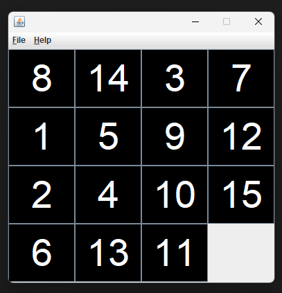

# Java 15 Puzzle Game

A classic 15-tile sliding puzzle game implemented in Java with a graphical interface using `Swing`.

## About the Game

This is a desktop version of the **15 Puzzle** where the objective is to place the numbered tiles in order by sliding them into the empty space.

---

## Features

- 4×4 grid with 15 movable tiles and one empty space
- Tile swapping with mouse clicks or arrow keys
- New game generation
- Predefined "Victory" layout for testing
- Simple GUI menu with keyboard shortcuts
- Victory message when puzzle is solved

---

## Project Structure

```
Java-15Puzzle/
├── src
    ├── CustomFrame.java     # Initializes the main application window
    ├── GamePanel.java       # Logic and rendering for the 15-puzzle grid
    ├── Menu.java            # Menu bar with File and Help options
    ├── Test.java            # Main entry point
└── README.md
```

---

## Getting Started

### Prerequisites

Make sure you have Java installed:

```bash
java -version
# Recommended: Java 8+
```

---

### How to Run

1. **Clone the repository**:

```bash
git clone https://github.com/p0lik0/Java-15Puzzle.git
cd Java-15Puzzle
```

2. **Compile the source files**:

```bash
javac *.java
```

3. **Run the game**:

```bash
java Test
```


---

## Controls

- Click a tile next to the empty space to move it
- ⬅️ ➡️ ⬆️ ⬇️ Use arrow keys to move tiles
- `Ctrl + N` – New Game  
- `Ctrl + V` – Show Victory state (for testing)  
- `Ctrl + E` – Exit  
- `Ctrl + A` – About

---

## Notes

- The puzzle is randomly shuffled at the start of each game.
- Some random states may be unsolvable (future improvement could add solvability check).

---

## License

This project is open-source and free to use for learning or personal purposes.


